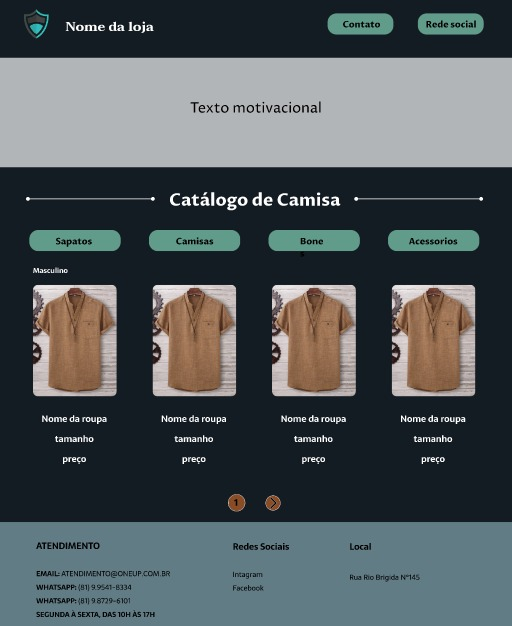

<h1>CS CALÇADOS</h1>

cs-calcados (Projeto Cancelado)
Este repositório continha o código-fonte de um projeto de um site de roupas chamado "cs-calcados". O objetivo era criar uma aplicação web completa para auxiliar na gestão de estoque, vendas e clientes de uma loja de calçados.

Status do Projeto
Este projeto foi cancelado e não está mais em desenvolvimento.

As razões para o cancelamento incluem:

O dono desistiu 

Embora o projeto tenha sido cancelado, as seguintes funcionalidades estavam planejadas:

Gerenciamento de estoque: 
- cadastro
- consulta de produtos.
  
Controle de vendas: 
- registro de vendas
- emissão de notas
- fiscais
- controle de pagamentos.
  
Gerenciamento de clientes:
- cadastro
- consulta de clientes.

